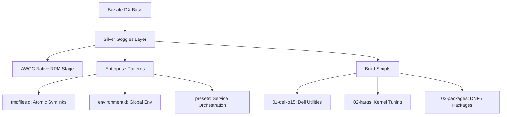

# Bazzite-DX-Silver-Goggles

> [!WARNING]
> I built this image for me. You may use it yourself, of course, but I provide no support. I strongly suggest learning how to customize your own image using the [ublue image template](https://github.com/ublue-os/image-template). Documentation can be found [here.](https://blue-build.org/)

**My system:** Dell G15 5520 Laptop, 12th Generation Intel Core i7-12700H, NVIDIA GeForce RTX 3060 6GB, 64GB DDR5 RAM
**Base image:** [Bazzite DX (KDE/NVIDIA)](https://bazzite.gg/) - _Slim edition: built specifically for my Dell G15 setup._

### Modifications:

- **Dell G15 (5520) Specific Tweaks**:
  - Install Dell management utilities (`smbios-utils-python`).
  - [AWCC (Alienware Command Center)](https://github.com/nklowns/AWCC): Native control for thermal modes and G-Mode.
  - **State Integrity**: Masks `thermald` and manages `/etc/awcc/database.json` via priority overrides.
  - **Declarative Tuning**: Boot-time Kernel Arguments via `bootc` (`/usr/lib/bootc/kargs.d/`).

---

# Architecture & Build Logic

This image follows the **"Personal Customization Layer"** pattern. It extends `bazzite-dx` with hardware-specific logic and an "Enterprise-grade" declarative configuration strategy.



## The "Silver Goggles" Priority Pattern

To ensure user-specific tweaks survive base image updates and potential RPM conflicts, the `build.sh` script handles configuration as a final priority layer, re-applying `system_files` after all package operations.

## The Bootc & DNF5 Transition

This image is built using the next-generation `bootc` logic and `dnf5`, preparing for Fedora 43+ standards:

- **Declarative KArgs**: Arguments are defined in [99-silver-goggles.toml](file:///home/cloud/dev/linux/uBlueOs/bazzite-dx-silver-goggles/build_files/02-kargs.sh) and placed in `/usr/lib/bootc/kargs.d/`. This is the [official bootc pattern](https://containers.github.io/bootc/building/kernel-arguments.html).
- **Native RPM Packaging**: AWCC is built in a [multi-stage Containerfile](file:///home/cloud/dev/linux/uBlueOs/bazzite-dx-silver-goggles/Containerfile), ensuring the final image is lean.

## Enterprise Declarative Patterns

1.  **Atomic Symlinks (tmpfiles.d)**: Managed via `L+` symlinks in `usr/lib/tmpfiles.d/`. This ensures the root filesystem is the only source of truth.
2.  **Global Environment (environment.d)**: Variables like `CHROME_EXTRA_FLAGS` are set in `usr/lib/environment.d/`, ensuring consistency between Wayland, X11, and terminal.
3.  **Service Orchestration**:
    - Services are enabled via **Systemd Presets** (`usr/lib/systemd/system-preset/`).
    - Conflicting services are **Masked In-Image** (symlinked to `/dev/null` in `/usr/lib/systemd/system/`) for absolute determinism:
      - `thermald.service`: Prevents conflicts with AWCC.
      - `systemd-udev-settle.service`: Fixes frequent boot hangs/delays when using VFIO and IOMMU kargs on Bazzite.

---

# Installation & Deployment

### Installation instructions:

Install any atomic Fedora (Silverblue, Kinoite, Bazzite, Aurora, ... etc) and run:
`rpm-ostree rebase ostree-image-signed:docker://ghcr.io/nklowns/bazzite-dx-silver-goggles:latest`

### Local Development

| Category   | Commands                                                                                 |
| ---------- | ---------------------------------------------------------------------------------------- |
| **Build**  | `just build`, `just build-fork <user> <branch>`, `just build-dev <user> <branch> <spec>` |
| **Apply**  | `just rebase-local` (full image rebase), `just hot-swap-awcc <path>` (live RPM swap)     |
| **Safety** | `just rollback-local`, `just rebase-official`, `just uninstall-awcc`                     |

### Component Hot-Swap (Deep Dive)

The `hot-swap-awcc` recipe uses a sophisticated mechanism for rapid iteration:

1. **Containerized Build**: Packages your local AWCC source using `rpmbuild` in a Fedora container.
2. **Version Injection**: Injects a `dev.swap` version to force `dnf` to accept the update.
3. **Filesystem Unlocking**: Uses `rpm-ostree usroverlay` to temporarily unlock the immutable filesystem.
4. **Live Application**: Installs via `rpm -Uvh --force` and handles `systemctl` service restarts.

# Flatpak Overrides

You can declaratively manage Flatpak permissions and environment variables. Overrides must be named after the **Flatpak App ID** (e.g., `com.google.Chrome`) and use the **KeyFile format**.

**Example (`system_files/usr/share/flatpak/overrides/com.google.Chrome`):**

```ini
[Environment]
CHROME_EXTRA_FLAGS=--ozone-platform=x11
```

_These overrides are synced as atomic symlinks via [flatpak-overrides.conf](file:///home/cloud/dev/linux/uBlueOs/bazzite-dx-silver-goggles/system_files/usr/lib/tmpfiles.d/flatpak-overrides.conf) using the `L+` pattern during build/boot._

---

# Validation & Health Checks

1. **Verify metadata recognition:**

   ```bash
   flatpak info --show-permissions com.google.Chrome
   ```

   Look for the `[Environment]` section synced via [flatpak-overrides.conf](file:///home/cloud/dev/linux/uBlueOs/bazzite-dx-silver-goggles/system_files/usr/lib/tmpfiles.d/flatpak-overrides.conf).

2. **Graphical verification (Flatseal):**
   - Open **Flatseal** -> **Google Chrome**.
   - The variable `CHROME_EXTRA_FLAGS` should be visible in the **"Environment"** section.

3. **Status health check:**
   - Run `ujust status` or `g15-status` to verify Dell hardware integration.
