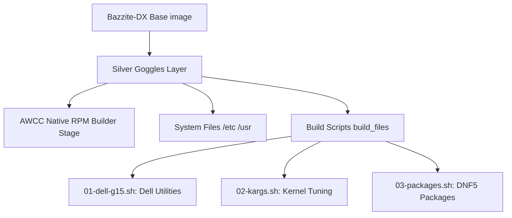

# Bazzite-DX-Silver-Goggles

> [!WARNING]
> I built this image for me. You may use it yourself, of course, but I provide no support. I strongly suggest learning how to customize your own image using the [ublue image template](https://github.com/ublue-os/image-template). Documentation can be found [here.](https://blue-build.org/)

My system: Dell G15 5520 Laptop, 12th Generation Intel Core i7-12700H, NVIDIA GeForce RTX 3060 6GB, 64GB DDR5 RAM

Base image: [Bazzite DX (KDE/NVIDIA)](https://bazzite.gg/) - _Slim edition: built specifically for my Dell G15 setup._

Modifications:

- Dell G15 (5520) Specific Tweaks
  - Install Dell management utilities (`smbios-utils-python`).
  - [AWCC (Alienware Command Center)](https://github.com/nklowns/AWCC): Native control for thermal modes and G-Mode.
  - **State Integrity**: Masks `thermald` and manages `/etc/awcc/database.json` via priority overrides.
  - **Declarative Tuning**: Boot-time Kernel Arguments via `bootc` (`/usr/lib/bootc/kargs.d/`).

# Architecture & Build Logic

This image follows the "Personal Customization Layer" pattern. It extends `bazzite-dx` with hardware-specific logic and a multi-layered configuration strategy.



## The "Silver Goggles" Priority Pattern

To ensure user-specific tweaks survive base image updates and potential RPM conflicts, the `build.sh` script handles configuration as a final priority layer:

## The Bootc & DNF5 Transition

This image is built using the next-generation `bootc` logic and `dnf5`, preparing for Fedora 43+ standards:

- **Declarative KArgs**: Instead of running commands at runtime, arguments are defined in [99-silver-goggles.toml](file:///home/cloud/dev/linux/uBlueOs/bazzite-dx-silver-goggles/build_files/02-kargs.sh) and placed in `/usr/lib/bootc/kargs.d/`. This is the [official bootc pattern](https://containers.github.io/bootc/building/kernel-arguments.html) for immutable images.
- **Native RPM Packaging**: AWCC is built in a [multi-stage Containerfile](file:///home/cloud/dev/linux/uBlueOs/bazzite-dx-silver-goggles/Containerfile) builder stage, ensuring the final image remains lean and contains only the necessary binaries.

# Installation instructions:

Install any atomic fedora (Silverblue, Kinoite, Bazzite, Aurora, ... etc)

Run:
`rpm-ostree rebase ostree-image-signed:docker://ghcr.io/nklowns/bazzite-dx-silver-goggles:latest`

# Local Development

To test changes on your local system:

1. **Build Your Image**:

   ```bash
   just build             # Standard build using default Spec
   just build-fork <user> <branch>    # From a Bazzite-DX fork (GHCR)
   just build-dev <user> <branch> <spec> # Full Integration test (GHCR + Custom AWCC)
   BASE_IMAGE=localhost/bazzite-dx:dev just build # Build using a locally built base
   ```

2. **Full System Test (requires reboot)**:

   ```bash
   just rebase-local      # Rebases your system to the locally built image
   just rollback-local    # Reverses the local rebase
   ```

3. **Component Hot-Swap (AWCC Only - no reboot)**:
   This is the fastest way to test AWCC changes. It builds an RPM from your local source and applies it live.

   ```bash
   # Usage: just hot-swap-awcc <path_to_AWCC_source>
   just hot-swap-awcc /home/cloud/dev/linux/uBlueOs/dell_related/AWCC
   ```

4. **Verify Installation & Health**:
   Check if the image and its components are functioning correctly:

   ```bash
   ujust status          # Runs the g15-status health check
   rpm -q awcc          # Should show version (production or dev.swap)
   rpm-ostree status    # Verify 'Unlocked: transient' if hot-swapped
   ```

5. **Safety & Reversal**:
   - Undo Local Rebase: `just rollback-local` (reboot required)
   - Reset to Official: `just rebase-official` (reboot required)
   - Undo AWCC Hot-Swap: `just uninstall-awcc` (live apply - no reboot)

## Component Hot-Swap (Deep Dive)

The `hot-swap-awcc` recipe uses a sophisticated mechanism to allow rapid iteration without system reboots:

1. **Containerized Build**: `dev-awcc-rpm` uses a Fedora container and `rpmbuild` to package your local AWCC source code.
2. **Version Injection**: It injects a `dev.swap` version and a modern Unix timestamp to force `dnf` and `rpm` to accept the update as a "newer" package.
3. **Filesystem Unlocking**: `install-awcc` uses `rpm-ostree usroverlay` to temporarily unlock the immutable filesystem.
4. **Live RPM Application**: The new RPM is installed via `rpm -Uvh --force`, immediately swapping the production binary with your development version.
5. **Service Management**: It automatically handles `systemctl stop/start` for the `awccd` service.

> [!TIP]
> This pattern is ideal for developing system-level services. To revert, simply run `just uninstall-awcc` to reset the transient filesystem layer.

> [!TIP]
> If `hot-swap-awcc` fails due to version conflicts, the script now automatically injects a `dev.swap` version to force the override.

# Flatpak Overrides

You can declaratively manage Flatpak permissions and environment variables by adding files to `system_files/etc/flatpak/overrides/`.

The files should be named after the Flatpak ID (e.g., `com.discordapp.Discord`) and use the `KeyFile` format.

Example (`system_files/etc/flatpak/overrides/com.google.Chrome`):
```ini
[Context]
env=CHROME_EXTRA_FLAGS=--ozone-platform=x11
```

These overrides are applied system-wide during the image build.
