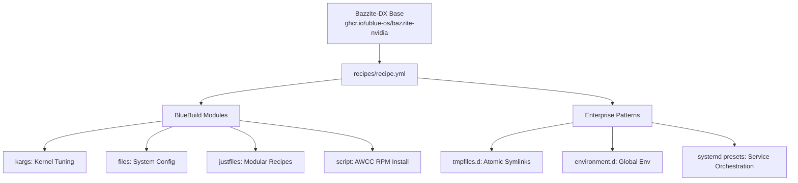

# Bazzite-DX-Silver-Goggles

> [!WARNING]
> I built this image for me. You may use it yourself, of course, but I provide no support. I strongly suggest learning how to customize your own image using the [ublue image template](https://github.com/ublue-os/image-template). Documentation can be found [here.](https://blue-build.org/)

**My system:** Dell G15 5520 Laptop, 12th Generation Intel Core i7-12700H, NVIDIA GeForce RTX 3060 6GB, 64GB DDR5 RAM
**Base image:** [Bazzite DX (KDE/NVIDIA)](https://bazzite.gg/) — _Slim edition: built specifically for my Dell G15 setup._

### Modifications:

- **Dell G15 (5520) Specific Tweaks**:
  - Install Dell management utilities (`smbios-utils-python`).
  - [AWCC (Alienware Command Center)](https://github.com/nklowns/AWCC): Native control for thermal modes and G-Mode, installed as a pre-compiled RPM.
  - **State Integrity**: Masks `thermald` and manages `/etc/awcc/database.json` via priority overrides.
  - **Declarative Tuning**: Boot-time Kernel Arguments via `bootc` (`/usr/lib/bootc/kargs.d/`).

---

# Architecture & Build Logic

This image follows the **"Personal Customization Layer"** pattern described in [`bazzite_dx_recipe_architecture.md`](../bazzite_dx_recipe_architecture.md). It extends `bazzite-dx` with hardware-specific logic using a fully **declarative BlueBuild** architecture — no `Containerfile`, no `build.sh`.


```mermaid
graph TD
    A[Bazzite-DX Base<br/>ghcr.io/ublue-os/bazzite-nvidia] --> B[recipes/recipe.yml]
    B --> C[BlueBuild Modules]
    C --> C1[kargs: Kernel Tuning]
    C --> C2[files: System Config]
    C --> C5[justfiles: Modular Recipes]
    C --> C3[script: AWCC RPM Install]
    B --> D[Enterprise Patterns]
    D --> D1[tmpfiles.d: Atomic Symlinks]
    D --> D2[environment.d: Global Env]
    D --> D3[systemd presets: Service Orchestration]
```

## Declarative Architecture (BlueBuild)

The entire build is driven by [`recipes/recipe.yml`](recipes/recipe.yml). This replaces the old imperative `Containerfile` + `build.sh` model with a YAML-declared state machine:

- **`kargs` module**: Kernel arguments injected via `bootc` at `/usr/lib/bootc/kargs.d/` — the [official bootc pattern](https://containers.github.io/bootc/building/kernel-arguments.html).
- **`justfiles` module**: Local G15 recipes in `files/justfiles/60-custom.just` are injected into the image as modular `ujust` commands.
- **`files` module**: Static system configuration from `files/system/` is overlaid onto `/`. Includes `tmpfiles.d`, `environment.d`, `systemd` presets, and Flatpak overrides.
- **`script` module**: Installs the pre-compiled AWCC RPM (`awcc-dev.rpm`) committed to the repo root. See [`docs/AWCC-BUILD.md`](docs/AWCC-BUILD.md) for details.

## Enterprise Declarative Patterns

1. **Atomic Symlinks (`tmpfiles.d`)**: Managed via `L+` symlinks in `files/system/usr/lib/tmpfiles.d/`. The root filesystem is the single source of truth — no `flatpak override` commands.
2. **Global Environment (`environment.d`)**: Variables like `CHROME_EXTRA_FLAGS` are set in `files/system/usr/lib/environment.d/`, ensuring consistency between Wayland, X11, and terminal sessions.
3. **Service Orchestration**:
   - Services are enabled via **Systemd Presets** (`files/system/usr/lib/systemd/system-preset/`).
   - Conflicting services are **masked in-image** (symlinked to `/dev/null`) for absolute determinism:
     - `thermald.service`: Prevents conflicts with AWCC fan control.
     - `systemd-udev-settle.service`: Fixes boot hangs with VFIO/IOMMU kargs.

---

# Installation & Deployment

### Installation

Install any atomic Fedora (Silverblue, Kinoite, Bazzite, Aurora, etc.) and run:

```bash
rpm-ostree rebase ostree-image-signed:docker://ghcr.io/nklowns/bazzite-dx-silver-goggles:latest
```

### Local Development

| Category        | Commands                                                                                         |
| --------------- | ------------------------------------------------------------------------------------------------ |
| **Check**       | `just check` (syntax + shellcheck + flatpak validation)                                          |
| **Build**       | `just build`, `just build-nocache`                                                               |
| **Apply**       | `just rebase-local` (full image rebase), `just hot-swap-awcc <path>` (live RPM swap, no reboot) |
| **Safety**      | `just rollback-local`, `just rebase-official`, `just uninstall-awcc`                             |
| **AWCC**        | `just build-awcc` (stable), `just build-awcc <src>` (local dev), `just install-awcc` (apply live) |

### `bluebuild` CLI (required for `just build`)

```bash
podman run --pull always --rm ghcr.io/blue-build/cli:latest-installer | bash
# Installs to /usr/local/bin/bluebuild
```

### AWCC RPM Hot-Swap (Deep Dive)

The `hot-swap-awcc` recipe enables rapid AWCC iteration without a full image rebuild:

1. **Containerized Build**: Compiles from local AWCC source via `rpmbuild` in an ephemeral `fedora:43` container (`just build-awcc <src>`).
2. **Filesystem Unlocking**: Uses `rpm-ostree usroverlay` to temporarily unlock the immutable filesystem.
3. **Live Application**: Installs via `rpm -Uvh --force` and restarts `awccd.service`.

The same `files/awcc-dev.rpm` used in hot-swap is committed to the repo and installed during the CI image build. See [`docs/AWCC-BUILD.md`](docs/AWCC-BUILD.md) for the full workflow.

---

# Flatpak Overrides

Flatpak permissions are managed declaratively. Override files are named after the **Flatpak App ID** (e.g., `com.google.Chrome`) and use **KeyFile format**, placed in `files/system/usr/share/flatpak/overrides/`.

**Example (`files/system/usr/share/flatpak/overrides/com.google.Chrome`):**

```ini
[Environment]
CHROME_EXTRA_FLAGS=--ozone-platform=x11
```

These overrides are synced as atomic symlinks via `tmpfiles.d` using the `L+` pattern during build/boot.

---

# Validation & Health Checks

1. **Verify Flatpak permissions:**

   ```bash
   flatpak info --show-permissions com.google.Chrome
   ```

   Look for the `[Environment]` section synced via `tmpfiles.d`.

2. **Graphical verification (Flatseal):**
   - Open **Flatseal** → **Google Chrome**.
   - The variable `CHROME_EXTRA_FLAGS` should be visible in the **"Environment"** section.

3. **Status health check:**

   ```bash
   just status   # Image config, local images, tooling versions
   just g15-status   # Dell G15 hardware health
   ```
