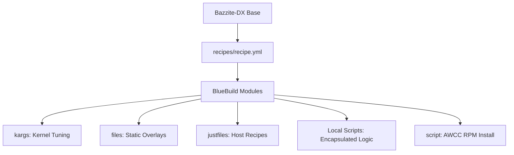

# Bazzite-DX-Silver-Goggles

> [!WARNING]
> I built this image for me. You may use it yourself, of course, but I provide no support. I strongly suggest learning how to customize your own image using the [ublue image template](https://github.com/ublue-os/image-template). Documentation can be found [here.](https://blue-build.org/)

**My system:** Dell G15 5520 Laptop, 12th Generation Intel Core i7-12700H, NVIDIA GeForce RTX 3060 6GB, 64GB DDR5 RAM
**Base image:** [Bazzite DX (KDE/NVIDIA)](https://bazzite.gg/) — _Slim edition: built specifically for my Dell G15 setup._

### Modifications:

- **Dell G15 (5520) Specific Tweaks**:
  - Install Dell management utilities (`smbios-utils-python`).
  - [AWCC (Alienware Command Center)](https://github.com/nklowns/AWCC): Native control for thermal modes and G-Mode, installed as a pre-compiled RPM.
  - **State Integrity**: Masks `thermald` and manages `/etc/awcc/database.json` via priority overrides.
  - **Declarative Tuning**: Boot-time Kernel Arguments via `bootc` (`/usr/lib/bootc/kargs.d/`).

---

# Architecture & Build Logic

This image follows the **"Personal Customization Layer"** pattern. It extends `bazzite-dx` with hardware-specific logic using a **modular BlueBuild** architecture. While the build structure is declarative, specific branding and system policies are encapsulated in **local imperative modules** for maximum flexibility.


```mermaid
graph TD
    A[Bazzite-DX Base] --> B[recipes/recipe.yml]
    B --> C[BlueBuild Modules]
    C --> C1[kargs: Kernel Tuning]
    C --> C2[files: Static Overlays]
    C --> C5[justfiles: Host Recipes]
    C --> C6[Local Scripts: Encapsulated Logic]
    C --> C3[script: AWCC RPM Install]
```

## Modular Architecture (BlueBuild)

The build is orchestrated by [`recipes/recipe.yml`](recipes/recipe.yml), combining declarative state with targeted script execution:

- **Declarative Modules**: `kargs`, `justfiles`, and `files` manage the static state of the image.
- **Encapsulated Logic Modules**: Local modules (`dx-flavor`, `dx-hardening`, etc.) perform dynamic transformations (like branding and DM policy) during the build process, ensuring the final image is pre-configured for the Dell G15.
- **Justfiles**: Local G15 recipes in `files/justfiles/66-silver-goggles.just` are injected into the image as modular `ujust` commands.
- **Boot-time Tuning**: Kernel arguments are injected via `bootc` — the [official bootc pattern](https://containers.github.io/bootc/building/kernel-arguments.html).

## Enterprise Declarative Patterns

1. **Atomic Symlinks (`tmpfiles.d`)**: Managed via `L+` symlinks in `files/system/usr/lib/tmpfiles.d/`. The root filesystem is the single source of truth — no `flatpak override` commands.
2. **Global Environment (`environment.d`)**: Variables like `CHROME_EXTRA_FLAGS` are set in `files/system/usr/lib/environment.d/`, ensuring consistency between Wayland, X11, and terminal sessions.
3. **Service Orchestration**:
   - Services are enabled via **Systemd Presets** (`files/system/usr/lib/systemd/system-preset/`).
   - Conflicting services are **masked in-image** (symlinked to `/dev/null`) for absolute determinism:
     - `thermald.service`: Prevents conflicts with AWCC fan control.
     - `systemd-udev-settle.service`: Fixes boot hangs with VFIO/IOMMU kargs.

---

# Installation & Deployment

### Installation

Install any atomic Fedora (Silverblue, Kinoite, Bazzite, Aurora, etc.) and run:

```bash
rpm-ostree rebase ostree-image-signed:docker://ghcr.io/nklowns/bazzite-dx-silver-goggles:latest
```

### Local Development

| Category        | Commands                                                                                         |
| --------------- | ------------------------------------------------------------------------------------------------ |
| **Check**       | `just check` (syntax + shellcheck + flatpak validation)                                          |
| **Build**       | `just build`, `just build-nocache`                                                               |
| **Apply**       | `just rebase-local` (full image rebase), `just hot-swap-awcc <path>` (live RPM swap, no reboot) |
| **Safety**      | `just rollback-local`, `just rebase-official`, `just uninstall-awcc`                             |
| **AWCC**        | `just build-awcc` (stable), `just build-awcc <src>` (local dev), `just install-awcc` (apply live) |

### `bluebuild` CLI (required for `just build`)

```bash
podman run --pull always --rm ghcr.io/blue-build/cli:latest-installer | bash
# Installs to /usr/local/bin/bluebuild
```

### AWCC RPM Hot-Swap (Deep Dive)

The `hot-swap-awcc` recipe enables rapid AWCC iteration without a full image rebuild:

1. **Containerized Build**: Compiles from local AWCC source via `rpmbuild` in an ephemeral Fedora container (version matched to base image).
2. **Filesystem Unlocking**: Uses `rpm-ostree usroverlay` to temporarily unlock the immutable filesystem.
3. **Live Application**: Installs via `rpm -Uvh --force` and restarts `awccd.service`.

The same `files/rpm-ostree/awcc-dev.rpm` used in hot-swap is committed to the repo and installed during the CI image build.

---

# Flatpak Overrides

Flatpak permissions are managed declaratively. Override files are named after the **Flatpak App ID** (e.g., `com.google.Chrome`) and use **KeyFile format**, placed in `files/system/usr/share/flatpak/overrides/`.

**Example (`files/system/usr/share/flatpak/overrides/com.google.Chrome`):**

```ini
[Environment]
CHROME_EXTRA_FLAGS=--ozone-platform=x11
```

These overrides are synced as atomic symlinks via `tmpfiles.d` using the `L+` pattern during build/boot.

---

# Validation & Health Checks

1. **Verify Flatpak permissions:**

   ```bash
   flatpak info --show-permissions com.google.Chrome
   ```

   Look for the `[Environment]` section synced via `tmpfiles.d`.

2. **Graphical verification (Flatseal):**
   - Open **Flatseal** → **Google Chrome**.
   - The variable `CHROME_EXTRA_FLAGS` should be visible in the **"Environment"** section.

3. **Status health check:**

   ```bash
   just status   # Image config, local images, tooling versions
   just g15-status   # Dell G15 hardware health
   ```

---

# Project N.O.M.A.D. (Offline Knowledge, AI & Maps)

[Project N.O.M.A.D.](https://www.projectnomad.us) (*Node for Offline Media, Archives, and Data*) is an offline-first knowledge server: Wikipedia and other ZIM archives via Kiwix, Khan Academy via Kolibri, offline maps, notes, and an AI assistant with RAG over your own documents. Upstream ships it as a Docker Compose stack for Debian; this image runs it as **rootless Podman Quadlet units**, and the differences below are deliberate.

## What runs, and where

| Unit | Container | Host port | Purpose |
| :--- | :--- | :--- | :--- |
| `nomad-admin.service` | `nomad_admin` | `61380` | Command Center (dashboard + API) |
| `nomad-dozzle.service` | `nomad_dozzle` | `61381` | Container log viewer |
| `nomad-mysql.service` | `nomad_mysql` | — | Application database |
| `nomad-redis.service` | `nomad_redis` | — | Job queue |
| `nomad-ollama.service` | `nomad_ollama_gpu` | `61382` | GPU inference (**separate on purpose** — see below) |

Units live in `/etc/containers/systemd/users/` and a systemd generator turns each `.container` into a `.service`. They are under `/etc` rather than `/usr` because **rootless Quadlet has no `/usr` search path** (`man podman-systemd.unit`); running them rootful to get `/usr/share/containers/systemd/` would forfeit the security property described under *Container socket access*.

All ports sit in this layer's reserved DX range **`61300-61399`** so nothing here squats a port a project's own dev server would want. Upstream defaults — `8080` for the Command Center, `11434` for Ollama, `9999` for Dozzle — are all changed for that reason.

## The AI assistant is not a Supply Depot app, and that is not an oversight

The Command Center can install Ollama itself. On this image that path silently produces a **CPU-only** assistant, and the reason is worth knowing before you click it.

NOMAD detects an NVIDIA GPU by looking for an `nvidia` key in the container engine's runtime map, then creates the container with Docker's `DeviceRequests` API. Podman's docker-compatible API accepts that payload and discards it — measured on this host:

```
POST /v1.41/containers/create  HostConfig.DeviceRequests[{Driver:nvidia,Count:-1}]
  -> 201 Created, Warnings: []
  -> container logs: NO_NVIDIA_DEVICES
```

Docker, given the identical payload on the same host, injects the devices. Nothing errors and nothing warns; the UI reports *"NVIDIA container runtime detected"* either way. The only podman-side workaround that worked was a global device default in `containers.conf`, which hands a GPU to **every** container the engine starts — MySQL and Redis included.

So GPU inference runs as its own unit with a real CDI device, and NOMAD is pointed at it as an external endpoint. That path is supported upstream: `OllamaService` checks the `ai.remoteOllamaUrl` setting first and only falls back to the Supply Depot container when it is unset.

**Wiring it up, once:** start it with `ujust ollama-up`, then in the Command Center go to **Settings → AI** and set the remote base URL to:

```
http://ollama:11434
```

That is the container-network alias, not a host port — the Command Center reaches Ollama directly over the shared network. Then `ujust ollama-pull-models` fetches models sized for 6 GB of VRAM (`llama3.2:3b`, `qwen2.5-coder:7b`, and `nomic-embed-text`, which is what the RAG indexer uses).

### The Supply Depot will say "AI Assistant — Stopped". Leave it stopped.

That entry tracks the Ollama the Command Center manages itself, and it is genuinely not
running — deliberately. Yours runs beside it, outside NOMAD's registry, which is the only way
it gets the GPU. The chat view is where the truth shows: it reports **Remote Connected**.

**Do not press Start on that card.** It would create a second Ollama, CPU-only for the reason
above, listening on its own port and holding its own copy of the weights, competing for the
same 6 GB of VRAM the moment anything loads a model. Nothing warns you — both would appear to
work, one just answers slowly. The same applies to installing "AI Assistant" from the catalog.

This is the price of the arrangement, and it was accepted knowingly: NOMAD cannot show a
container it does not manage, and it cannot manage this one without taking the GPU away.

**The container is called `nomad_ollama_gpu`, and the suffix is load-bearing.** `admin/constants/service_names.ts` reserves `nomad_ollama` for the instance the Command Center manages itself, and the Command Center holds the container socket — so anything wearing one of its service names is a container it may stop, remove or recreate at will. The first version of this unit was named `nomad_ollama`, which handed it straight back to the orchestrator this arrangement exists to keep it away from: it answered the admin's probes and disappeared in the same second, leaving no stop reason in its own journal. The network alias stays `ollama`, so the endpoint you configure in the UI never changes; only the container name has to stay outside NOMAD's namespace.

Qdrant, which backs RAG search, is not in the management stack either — it is provisioned on demand as a Supply Depot app when you first use the knowledge base. It needs no GPU, so it is unaffected by the above.

## Storage layout

```
/var/srv/nomad/storage    ZIMs, maps, notes, uploads   (the Command Center's /app/storage)
/var/srv/nomad/mysql      database
/var/srv/nomad/redis      queue persistence
/var/srv/nomad/ollama     model weights
```

They are **siblings, not nested**. The Command Center resolves the host path behind its own `/app/storage` mount and rewrites every child app's bind to live underneath it, so a database inside `storage/` would be counted as offline content by the disk-usage view and the content browser — and be reachable by a content reset.

Three properties are applied declaratively at boot, none of which `tmpfiles.d` can express, so they live in `bazzite-dx-groups`:

- **`chattr +C` (btrfs nodatacow)** on the database directories. MySQL and Redis do random writes inside large files, the pathological case for copy-on-write. This only works while the directory is **empty** — `+C` is inherited by new files and does nothing to existing ones — so it is set before first start or not at all. If you ever see the warning about a directory already having contents, the window has closed and the fix is recreating that store.
- **SELinux `container_file_t`** on the whole tree. An unlabelled bind is denied outright to a container. This cannot be solved with `:z` on our own volumes alone, because the Command Center generates binds for the apps it spawns and those carry no `:z`; labelling the root covers all of them.
- **`CACHEDIR.TAG`** in `storage/`, honoured by restic, borg, tar, duplicity and `rsync --exclude-caches`. ZIM archives and model weights are re-downloadable, so they are excluded from backups by convention rather than by an exclude list you would have to maintain.

### Rootless means the files are not yours, exactly

Containers write as *subordinate* UIDs: a file created by MySQL as uid 999 inside the container lands as uid 524287+ on the host. Your own account cannot read, `chown`, or even `rm` it. This is how user namespaces work, not a misconfiguration — and it is why deleting an old ZIM with `rm -rf` fails with *Permission denied*.

Use **`ujust nomad-shell`**, which drops you into `podman unshare bash`. Inside that namespace the files are owned by root and behave normally.

## Container socket access — an explicit security decision

`nomad_admin` and `nomad_dozzle` mount the podman socket and run with **SELinux confinement disabled** (`SecurityLabelDisable=true`). Without it the bind is denied outright and the Command Center is an empty dashboard — orchestrating Supply Depot apps *is* what it does.

This is acceptable here specifically because the stack is **rootless**. The socket is the user's own `podman`, so a container that reaches it gains what the user already has rather than root on the machine. Under rootful Docker the same configuration would be handing out host root, and this layer would not ship it. That difference is the main reason the engine choice went to podman despite upstream testing only Docker.

MySQL and Redis are **not** exempted — they touch storage only, and the SELinux label above covers them.

A tighter alternative exists and was not taken: a custom SELinux module permitting `container_t` → `container_var_run_t:sock_file`, which would keep the rest of the confinement. Worth revisiting if this surface grows.

## Nothing starts at boot, and `enable` is the wrong verb here

Lingering is enabled for the desktop user on this image (`loginctl show-user $USER -p Linger` → `yes`). That changes what enabling a *user* unit means: without lingering an enabled unit starts at login, **with** lingering it starts at **boot**, with no login at all, and survives logout.

So `ujust nomad-up` uses `systemctl --user start`, never `enable`. The stack runs until you stop it or reboot. This is a gaming machine as well as a workstation, and a permanently-resident MySQL, Redis, Node server and 6 GB inference engine is exactly the background cost that policy exists to prevent.

If you genuinely want NOMAD always-on, `systemctl --user enable nomad-admin.service` is yours to run deliberately.

## Secrets

`APP_KEY`, `MYSQL_ROOT_PASSWORD` and the database password are generated on first `nomad-up` into `/var/srv/nomad/.env` (mode `0600`) and **never overwritten**, so they survive image rebases. That matters more than it looks: MySQL only reads its credentials when initialising an empty data directory, so regenerating them later would leave the database on the old ones with *"Access denied"* as the only symptom.

`URL` starts at `http://localhost:61380` and is rewritten automatically by `ujust remote-nomad-setup` — AdonisJS builds absolute links and CORS from it, and a stale value produces localhost URLs in a browser that arrived over the tailnet, which looks like an application bug.

## Image pinning

Digests are pinned **inline in the Quadlet units** and bumped by Renovate. There is no template and no render step: the file that ships is the file that is pinned. `ujust nomad-update` pulls what the current image pins — a version bump arrives through a rebase, not through that command.

## `ujust` commands

| Command | Action |
| :--- | :--- |
| `ujust nomad-up` | Start the stack (Command Center, database, queue, log viewer) |
| `ujust nomad-down` | Stop the stack; data is preserved |
| `ujust nomad-status` | Unit states, containers, GPU/VRAM, disk usage, nodatacow check |
| `ujust nomad-update` | Re-pull the pinned images and restart |
| `ujust nomad-shell` | `podman unshare` shell for managing NOMAD's files |
| `ujust ollama-up` | Start GPU inference |
| `ujust ollama-down` | Stop it and release VRAM |
| `ujust ollama-pull-models` | Fetch the models NOMAD actually names (`nomic-embed-text:v1.5`, `qwen2.5:3b`, `llama3.2:3b`) |
| `ujust remote-nomad-setup` | Publish the Command Center on the tailnet (`https://…:61380`) |
| `ujust remote-nomad-teardown` | Unpublish it and restore the local `URL` |
| `ujust nomad-firewall-on` | Open `61380`/`61381` on the local network |
| `ujust nomad-firewall-off` | Close them again |

## What the firewall does and does not do here

`tailscale0` sits in firewalld's `trusted` zone, which accepts everything. That makes the firewall recipes above a LAN-only control — and it means **anything published on `0.0.0.0` is reachable by every device on your tailnet**, with no `tailscale serve` and no firewall rule.

This is not hypothetical. While the stack was briefly published on all interfaces:

```
curl http://<host>:61381/            -> HTTP 200      (Dozzle: logs of every container)
curl http://<host>:61382/api/tags    -> {"models":[]} (Ollama: no auth, no rate limit)
```

So the containers publish on `127.0.0.1` instead, and `ujust remote-nomad-setup` is the one deliberate way out — which also gets you real TLS rather than plain HTTP. It is the same shape code-server and Cockpit already use. Nothing internal is affected: the Command Center talks to its apps over the container network, not through host ports.

If you want to share NOMAD with specific machines rather than your whole tailnet, that is a Tailscale ACL decision. firewalld cannot express it.

---

# 🎨 Visual Studio (ComfyUI, FLUX.1 & LTX-Video)

The **Visual Studio** runs [ComfyUI](https://github.com/comfyanonymous/ComfyUI) with rootless GPU acceleration inside the shared `project-nomad_default.network` on port `61384`.

- **CyberRealistic V9 & SD 1.5**: Photorealistic 8K UHD avatars generated in sub-10s with DDR5 pinned cache.
- **LivePortrait Neural Animation**: 3D mesh deformation and lip synchronization driven by audio or reference video at ~9.7 FPS on RTX 3060.
- **Persistent SSD Environment**: All Python toolkits and custom nodes are preserved in `/var/srv/visual/site-packages` on SSD, enabling sub-2s startup with **zero runtime pip installs at boot**.

### `ujust` commands (AI Studio Visual)

| Command | Action |
| :--- | :--- |
| `ujust aistudio-visual-up` (ou `comfyui-up`) | Start the ComfyUI GPU container (`http://localhost:61384`) |
| `ujust aistudio-visual-down` (ou `comfyui-down`) | Stop ComfyUI and release all 6 GB VRAM |
| `ujust aistudio-visual-status` (ou `comfyui-status`) | Detailed diagnostics (VRAM usage, API health, rootless permissions) |
| `ujust aistudio-visual-purge` (ou `comfyui-vram-purge`) | Instant VRAM purge (unload GPU models without stopping container) |
| `ujust aistudio-visual-animate <img_8k> <audio_wav>` | Animate any portrait with speech and LivePortrait neural lip sync |
| `ujust comfyui-sync` | Synchronize Python packages from declarative `requirements.txt` to SSD |
| `ujust comfyui-install <pkg>` | Install/upgrade a package into `/var/srv/visual/site-packages` live with no OS reboot |
| `ujust comfyui-container-shell` | Open interactive bash terminal inside the running container |
| `ujust remote-ai-setup` | Expose ComfyUI over Tailnet with TLS (`https://…:61384`) |

---

# 🎙️ AI Studio Audio (Speaches Voice TTS & STT, ChatTTS Expressive & Music)

The **AI Studio Audio** stack provides standard OpenAI-compatible endpoints (`/v1/audio/speech` and `/v1/audio/transcriptions`) running **100% on CPU cores and 64GB DDR5 (0 MB VRAM)**, leaving the RTX 3060 entirely free for gaming or visual diffusion:

1. **🗣️ OpenAI Speech Microservice (`:61386`)**: Speaches AI engine serving Piper TTS (Brazilian Portuguese Faber) and Faster-Whisper real-time STT.
2. **🎭 Conversational Expressive Voice**: ChatTTS synthesis with natural laugh tags (`[laugh]`), emotional hesitations (`[oral_2]`), and speech pauses (`[break_4]`).
3. **🧬 Zero-Shot Voice Cloning**: Sub-second voice cloning using Piper base phonetics and OpenVoice V2 tone conversion.
4. **🎹 Instrumental Soundtracks**: Meta MusicGen on CPU with zero GPU VRAM impact.
5. **📁 Strict XDG Output Directory Compliance**:
   - Visual Outputs (8K Portraits & MP4 Videos): `${XDG_PICTURES_DIR:-$HOME/Pictures}/AI_Studio/`
   - Acoustic Outputs (WAV & MP3 Audio): `${XDG_MUSIC_DIR:-$HOME/Music}/AI_Studio/`

### `ujust` commands (AI Studio Audio)

| Command | Action |
| :--- | :--- |
| `ujust aistudio-audio-up` (ou `tts-up`) | Start the Speaches Voice service (`:61386`) |
| `ujust aistudio-audio-down` (ou `tts-down`) | Stop the Speaches Voice service |
| `ujust aistudio-audio-status` (ou `tts-status`) | Check OpenAI endpoint models and disk health |
| `ujust clone-voice <ref_audio> <text>` | Clone voice in zero-shot with Brazilian Portuguese foundation |
| `ujust synthesize-expressive <text>` | Synthesize human-like speech with natural laughter and pauses |
| `ujust generate-soundtrack <prompt>` | Generate instrumental music on CPU (0 MB VRAM) |
| `ujust produce-master-video <img_8k> <voice_wav> <music_wav>` | Render final 48 FPS video with sidechain auto-ducking audio |
| `ujust remote-audio-setup` | Expose Speaches Voice service over Tailnet with TLS (`:61386`) |


