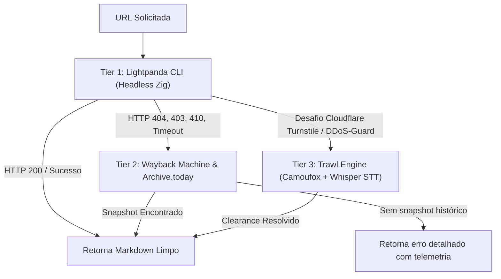

# 🌐 Agent Mesh — Developer & Agent Cheat-Sheet

> **Ambiente**: Bazzite Atomic (Dell G15 5520, KDE/NVIDIA, Fedora Atomic)  
> **Filosofia de Design**: **KISS & Delegação Lean**. Delegamos busca, agregação, extração e IA diretamente aos projetos open source upstream especializados (SearXNG, Vane, Tor, Trawl, Lightpanda, `ia` CLI). A camada de script/MCP atua estritamente como uma casca fina (thin client).  
> **Boot Impact Policy**: Zero cold-boot overhead. Serviços pesados operam em standby e sobem sob demanda.

---

## 1. Mapeamento de Portas e Serviços (Faixa Reservada DX `61300-61399`)

Para evitar conflitos com servidores locais de desenvolvimento (3000, 5173, 8080, etc.), todos os serviços DX da malha utilizam a faixa reservada:

| Serviço | Contêiner / Binário | Porta Loopback | Exposição Tailscale (TLS) | Consumo Médio | Política de Boot |
| :--- | :--- | :--- | :--- | :--- | :--- |
| **SearXNG** | `nomad-searxng` | `127.0.0.1:61387` | `https://bazzite.<tailnet>:61387` | ~120 MB RAM | On-demand / Auto-wake |
| **Redis / Valkey** | `nomad-redis` | `127.0.0.1:6379` | *Apenas rede OCI interna* | ~30 MB RAM | Dependência do SearXNG |
| **Tor Proxy** | `nomad-tor` | `127.0.0.1:9050` (SOCKS5)<br>`127.0.0.1:9080` (HTTP) | *Loopback estrito* | ~25 MB RAM | Dependência do SearXNG / Tor |
| **Vane (Perplexica)** | `nomad-vane` | `127.0.0.1:61385` | `https://bazzite.<tailnet>:61385` | ~200 MB RAM (Teto 1.5G) | On-demand (`ujust vane-up`) |
| **Ollama (GPU)** | `nomad-ollama` | `127.0.0.1:61382` | *Loopback estrito* | ~200 MB RAM + 2-4 GB VRAM | On-demand (`ujust ollama-up`) |
| **Trawl (Anti-Bot)** | `nomad-trawl` | `127.0.0.1:8191` (API)<br>`127.0.0.1:8192` (Proxy) | *Loopback estrito* | ~250-400 MB RAM (Teto 1.5G) | Standby (`ujust trawl-up`) |
| **Lightpanda** | `/usr/bin/lightpanda` | `127.0.0.1:9225` (CDP) | *Loopback estrito* | 0 MB boot (efêmero CLI) | On-demand (executável Zig) |
| **YaCy (P2P DHT)** | `nomad-yacy` | `127.0.0.1:8090` | *Loopback estrito* | ~1.5 - 2 GB RAM | Standby estrito (`ujust yacy-up`) |

---

## 2. Comandos de Ciclo de Vida (`ujust`)

Gerenciamento declarativo via `systemd --user` integrado com receitas do Justfile:

```bash
# 📊 Diagnóstico Geral
ujust agent-mesh-status      # Exibe status consolidado de todos os serviços e portas CDP
ujust mesh-status            # Apelido rápido para o status geral

# 🔍 SearXNG (Metapesquisa Soberana)
ujust searxng-up             # Inicia Redis + Tor + SearXNG
ujust searxng-down           # Desativa o SearXNG
ujust searxng-status         # Status e telemetria da unidade
ujust searxng-logs           # Acompanha logs do contêiner em tempo real
ujust remote-searxng-setup   # Expõe SearXNG via Tailscale Serve com TLS válido
ujust remote-searxng-teardown# Remove SearXNG do Tailscale Serve

# 🧠 Vane / Perplexica (Deep Research & IA)
ujust vane-up                # Inicia Vane + SearXNG + Ollama GPU automaticamente
ujust vane-down              # Desativa o Vane (avisa se a GPU ainda estiver com VRAM alocada)
ujust vane-status            # Status do serviço Vane
ujust vane-logs              # Logs do Vane
ujust remote-vane-setup      # Expõe o Vane no Tailscale com TLS

# 🤖 Ollama GPU (Inferência Local)
ujust ollama-up              # Inicia o Ollama com passthrough NVIDIA
ujust ollama-down            # Encerra o Ollama liberando VRAM da GPU
ujust ollama-models          # Lista modelos baixados (qwen2.5:3b, qwen2.5-coder:7b, nomic-embed-text)

# 🛡️ Trawl (Bypass de Cloudflare Turnstile, DDoS-Guard & WAFs)
ujust trawl-up               # Inicia o serviço Trawl (solver Firefox Camoufox + Whisper STT)
ujust trawl-down             # Desativa o Trawl
ujust trawl-status           # Status do Trawl
ujust trawl-logs             # Acompanha resolução de desafios anti-bot

# 🧅 Tor & YaCy (Darknet & P2P)
ujust tor-up / tor-down      # Controle do proxy Tor SOCKS5/HTTP
ujust yacy-up / yacy-down    # Controle do nó YaCy P2P
```

---

## 3. Esferas de Busca e Atalhos ("Bangs") do SearXNG

O SearXNG está configurado com 7 esferas temáticas livres de anúncios e rastreadores:

| Esfera / Categoria | Motores Nativos Integrados | Atalhos de Busca ("Bangs") |
| :--- | :--- | :--- |
| **`general`** | Brave, Google CSE, Mojeek, Qwant, Wikipedia, Wikidata | `!general`, `!br`, `!wp`, `!wd` |
| **`it`** (Engenharia & TI) | GitHub, GitLab, StackOverflow, Arch Linux Wiki, PyPI, NPM, Crates.io, Docker Hub, Repology, NVD (CVEs), HuggingFace | `!it`, `!gh`, `!gl`, `!so`, `!al`, `!pypi`, `!npm`, `!crates`, `!nvd`, `!hf` |
| **`science`** (Ciência) | arXiv, Semantic Scholar, OpenAlex, PubMed, Anna's Archive, Z-Library | `!science`, `!arxiv`, `!sem`, `!zlib`, `!annas` |
| **`indie`** (Small Web) | Marginalia (anti-SEO / phlogs), Neocities, Mwmbl | `!indie`, `!marginalia`, `!neocities`, `!mwmbl` |
| **`p2p`** (Descentralizada) | Mwmbl (0 RAM, API pública), YaCy (pool público ex: KIT + local) | `!p2p`, `!mwmbl`, `!yacy` |
| **`onions`** (Darknet) | Ahmia (roteamento exclusivo via SOCKS5 `socks5h://tor:9050`) | `!onions`, `!ahmia`, `!onion` |
| **`archive`** (Histórica) | OpenLibrary (Internet Archive), Z-Library, Library of Congress (`locgov`), Anna's Archive | `!archive`, `!openlib`, `!zlib`, `!locgov` |

> [!TIP]
> **Preservação Nativa**: Na interface web do SearXNG, todo resultado possui um link "cached" apontando diretamente para `https://web.archive.org/web/<url>`.

---

## 4. Ferramenta CLI `mesh-search` & Interface MCP

O script `/home/cloud/dev/IDEs/global-harness/bin/mesh-search` é registrado como servidor MCP (`agent-mesh`) para Claude, Gemini e Antigravity:

### Exemplos via Terminal:
```bash
# Busca geral
mesh-search search "linux kernel btrfs"

# Busca em categoria ou apelido temático
mesh-search search --category it "rust tokio async"
mesh-search search --category science "transformer attention mechanisms"
mesh-search search --category archive "operating systems silberschatz"
mesh-search search --category onions "threat intelligence"

# Deep Research com síntese e citações (via Vane + Ollama)
mesh-search research "Quais as novidades do kernel Linux 6.13 para drivers de rede?" --mode fast
mesh-search research "Análise comparativa entre Btrfs subvolumes e ZFS datasets" --mode deep

# Extração limpa de página da web em Markdown
mesh-search fetch "https://github.com/torvalds/linux"
mesh-search fetch "https://site-com-cloudflare.com" --trawl     # Forçar bypass anti-bot
mesh-search fetch "http://site-morto-404.com/artigo"           # Fallback automático no Wayback Machine
mesh-search fetch "https://exemplo.com" --archive              # Forçar snapshot histórico do passado
mesh-search fetch "http://exemplo.onion" --tor                 # Acesso a sites onion via Tor

# Diagnóstico e telemetria de saúde
mesh-search health              # Exibe estado dos contêineres e alertas de motores
mesh-search health --probe      # Dispara sonda ativa em tempo real nas esferas
mesh-search health --json       # Saída legível por máquina para automações
```

### Ferramentas Expostas ao Agente MCP:
1. `mesh_search(query, category?, engines?, limit?)`: Metapesquisa rápida e anonimizada.
2. `mesh_research(query, mode?)`: Investigação recursiva com síntese de texto e citações (`fast` ou `deep`).
3. `mesh_fetch(url, use_tor?, trawl?, archive?)`: Leitura limpa de páginas com suporte a SPAs JS, contorno de WAFs e resgate no Wayback Machine.
4. `mesh_status(probe?)`: Auditoria de resiliência e saúde dos nós OCI da malha.

---

## 5. Cascata de Extração Web em 3 Tiers (`mesh_fetch`)

Ao extrair o conteúdo de uma página web, a malha utiliza uma cascata de resiliência sem intervenção manual:



---

## 6. Internet Archive Standalone CLI (`ia`)

Instalado de forma isolada via `uv tool` em `~/.local/bin/ia` (v5.11.1). Ferramenta oficial mantida pelo time do Internet Archive.

```bash
# 🔍 Busca de Metadados no Acervo
ia search 'title:"operating systems"' -f identifier -f title
ia search 'collection:softwarelibrary_msdos' -f identifier -f title

# 📄 Full-Text Search (FTS) dentro do conteúdo de livros e documentos
ia search -F 'eBPF networking kernel'

# 📋 Exibir Metadados Completos de um Item em JSON
ia metadata <identifier>

# 💾 Download Direto de Arquivos de um Item
ia download <identifier> --glob="*.pdf"
ia download <identifier> --destdir=~/Downloads
```

---

## 7. Solução de Problemas Comuns (Troubleshooting)

* **SearXNG retornando 502 no primeiro comando após o boot**:
  * O `mesh-search` já gerencia o auto-start com tolerância de 25s. Caso ocorra timeout manual: `ujust searxng-up`.
* **Vane com erro *"Failed to connect to the server"***:
  * O Vane precisa do Ollama para listar provedores de modelo. Rode `ujust vane-up` (que inicializa o Ollama GPU automaticamente).
* **Liberar VRAM da NVIDIA após usar Deep Research**:
  * Rode `ujust ollama-down`.
* **Erro de certificado SSL no Trawl proxy**:
  * O certificado CA é gerado automaticamente em `/var/srv/trawl/ca/proxy-ca.crt`. O `mesh-search` o consome de forma transparente.
