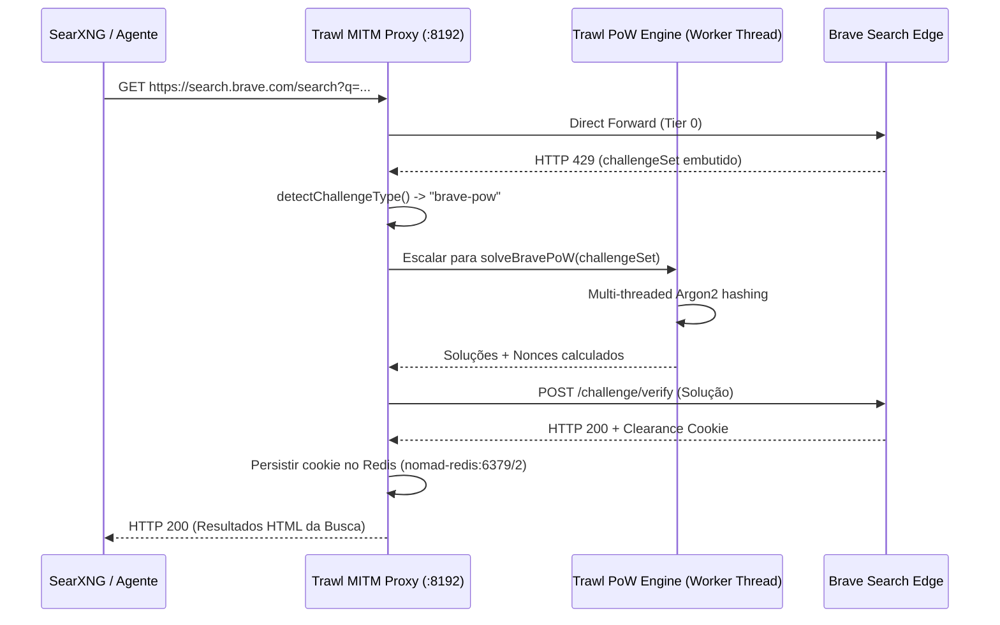

# Especificação Técnica: Solver de Proof-of-Work (PoW) no Trawl

> **Status**: Backlog Estratégico (Melhoria Futura)  
> **Componente Alvo**: [`ghcr.io/germondai/trawl`](https://github.com/germondai/trawl) (`nomad-trawl.container`)  
> **Contexto**: Bypass transparente de desafios de rate-limiting e anti-bot baseados em cálculo criptográfico (Argon2 / SHA / Scrypt) servidos com HTTP 429.

---

## 1. Contexto e Motivação

Durante a investigação da degradação de busca na categoria `it` do SearXNG, descobriu-se que o motor de busca **Brave Search (`search.brave.com`)** não aplica rate-limits simples por contagem de IP, mas sim um **desafio client-side de Proof-of-Work (PoW)** quando detecta padrões de tráfego automatizado ou residenciais sem sessão prévia.

O scraper HTTP do SearXNG (`brave.py`) recebe um status `HTTP 429` com o desafio no corpo da página e imediatamente suspende o motor por 180 segundos (`SearxEngineTooManyRequestsException`). Como o Trawl atualmente só intercepta e resolve desafios Cloudflare (Turnstile), AWS WAF e DataDome via browser interativo, o desafio PoW passa direto pelo proxy MITM `:8192` sem ser solucionado.

Este documento formaliza a arquitetura necessária para equipar o Trawl com a capacidade de detectar, calcular e submeter soluções de PoW de forma autônoma.

---

## 2. Anatomia do Desafio PoW (Brave Search)

A inspeção do payload HTTP 429 de `https://search.brave.com/search?q=...` revelou o seguinte contrato de dados:

```json
{
  "challengeSet": {
    "set_token": "e44ad7711210efec73c41a168d6955f6",
    "tokens": [
      "71282469e308095a469f1cb8a4cf9d37",
      "bfd6b8b396527649530158f7a3d33379",
      "7c133076ada0ea8ed71dacc25e5d65ec"
    ],
    "zero_count": 1,
    "hash_function_params": {
      "iterations": 2,
      "memory_size": 512,
      "hash_length": 32,
      "parallelism": 1
    },
    "solution_limit": 5000
  }
}
```

### Mecanismo de Funcionamento
1. **Algoritmo**: O `hash_function_params` parametriza uma função de memory-hard hashing (Argon2id ou variante adaptada em WebAssembly).
2. **Dificuldade**: `zero_count: 1` define a condição de prefixo de zeros necessária no hash final gerado a partir do `token` + nonce.
3. **Escopo**: O cliente recebe uma lista de tokens e precisa iterar nonces até encontrar um hash que satisfaça a dificuldade dentro do `solution_limit`.
4. **Finalização**: O navegador cliente executa o script JS em background, envia o conjunto de soluções via POST para `/challenge/verify` (ou anexa em cookies de sessão), e a borda (CloudFront/Brave edge) libera o IP/sessão com HTTP 200.

---

## 3. Arquitetura Proposta para o Trawl

O Trawl opera em 4 Tiers de resolução (`@trawl/tiers`). A melhoria de PoW deve se integrar harmoniosamente na camada de proxy MITM e no pipeline de tiers:



---

## 4. Plano de Implementação Modular

### Fase 1: Detecção Heurística (`packages/tiers/src/utils/detect.ts`)
Adicionar detecção de desafios de PoW nos inspectores de HTML e headers:

```typescript
export function hasBravePoWChallenge(html: string, status?: number): boolean {
  if (status !== 429) return false;
  return /challengeSet\s*:\s*\{/i.test(html) && /hash_function_params/i.test(html);
}
```

Atualizar o enum `ChallengeType` para incluir `"brave-pow"`.

### Fase 2: Módulo de Solução Criptográfica (`packages/tiers/src/solvers/pow.ts`)
Implementar o loop de busca de nonces utilizando `node:worker_threads` ou bindings nativos de Rust/C++ (`@node-rs/argon2` ou WASM compilado com SIMD) para evitar travamento do event-loop do Node.js:

* Entrada: `tokens`, `memory_size`, `iterations`, `zero_count`.
* Processamento: Divisão do espaço de busca de nonces entre os núcleos disponíveis da CPU.
* Tempo alvo de resolução: **< 400ms**.

### Fase 3: Interceptação no Proxy MITM (`apps/api/src/proxy/directForward.ts`)
* Quando `status === 429` e `challengeType === "brave-pow"`, marcar `isChallengeWall = true`.
* Redirecionar o fluxo para o solver em vez de repassar o 429 bruto para o SearXNG.
* Requisitar a validação, capturar os cookies de liberação (`__cf_bm`, `brave_session`, etc.) e persistir no banco Redis DB 2.
* Reexecutar a query original de forma transparente e entregar o HTML final com status 200 para o SearXNG.

---

## 5. Análise de Riscos e Diretrizes de Governança

1. **Anti-Bot Arms Race**: Provedores de busca mudam parâmetros e ofuscam scripts de PoW frequentemente. O PoW solver é uma contramedida técnica frágil a longo prazo se mantida isoladamente.
2. **Prioridade Arquitetural**: A **API Oficial (`braveapi`)** deve ser sempre a escolha preferencial de produção por possuir quota legal gratuita (2.000 req/mês), estabilidade de contrato e zero consumo desnecessário de CPU do host.
3. **Escopo do Solver**: O solver de PoW deve ser considerado uma **ferramenta de resiliência de último nível (Tier 3 fallback)** para scrapers legados que não possuem suporte a API keys ou quando quotas de API estiverem esgotadas.
